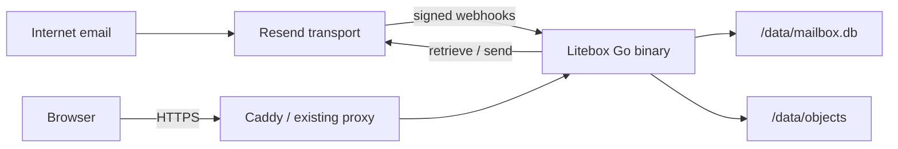

# Litebox

[](https://github.com/Nader-jo/Litebox/actions/workflows/ci.yml)
[](https://github.com/Nader-jo/Litebox/actions/workflows/security.yml)
[](https://github.com/Nader-jo/Litebox/releases/latest)
[](https://github.com/Nader-jo/Litebox/pkgs/container/litebox)
[](https://scorecard.dev/viewer/?uri=github.com/Nader-jo/Litebox)
[](https://goreportcard.com/report/github.com/Nader-jo/Litebox)
[](LICENSE)
[](CONTRIBUTING.md)

**A brutally lightweight, self-hosted human mailbox powered by Resend.**

Litebox gives custom-domain addresses real browser inboxes without asking you to run SMTP, IMAP, Redis, Postgres, Elasticsearch, a queue broker, or a JavaScript production runtime. One installation can host independent mailboxes, aliases, multiple administrators, and multiple browser sessions while retaining the one-container, one-volume default.

> [!IMPORTANT]
> Litebox is pre-1.0 software. Back up `/data`, review the [security model](docs/THREAT_MODEL.md), and test with a non-critical domain before adopting it for important mail.

## Why Litebox?

You own a domain and want `hello@example.com`. Resend already handles the hard internet-facing transport. Litebox owns the part you actually interact with:

- Inbox, unread state, threaded conversations, Sent, Drafts, Archive, Starred, and Trash;
- Compose, Reply, Reply all, CC/BCC, and attachments;
- provider delivery states and retry diagnostics;
- signed, replay-safe webhook ingestion backed by a durable SQLite job queue;
- local raw `.eml` and attachment retention independent of provider retention;
- strict inbound HTML sanitization and remote-image blocking;
- full-text search with useful operators;
- first-run setup, Argon2id passwords, hashed sessions, CSRF protection, and login throttling;
- independent mailboxes, shared aliases, per-mailbox roles, mailbox switching, and revocable device sessions;
- one signed GHCR image tag that runs on Linux AMD64 and ARM64 VPS hosts;
- built-in `doctor`, `backup`, `restore`, `reindex`, and password-recovery commands;
- responsive server-rendered UI using Go, templ, vendored HTMX, and custom CSS.
- mobile search, keyboard navigation, shortcut help, and clear progress/confirmation feedback.

Litebox is a mailbox, not a mail server and not a Gmail clone.

## Try it now

Start a private local demo with one command. It needs only Docker, binds to
`127.0.0.1`, and does not require a domain or Resend account:

```bash
curl --proto '=https' --tlsv1.2 -fsSL \
  https://github.com/Nader-jo/Litebox/releases/latest/download/setup.sh | \
  sh -s -- --demo
```

Open <http://localhost:8080/setup>. Demo data remains in the
`litebox-demo-data` Docker volume until you delete it. Real email receiving and
sending are disabled in demo mode.

## Architecture



The required runtime graph is deliberately small:

| Component | Default | Purpose |
| --- | --- | --- |
| Litebox | Required | UI, auth, webhooks, workers, provider adapter |
| SQLite | Embedded | Metadata, sessions, jobs, FTS5, mailbox state |
| Filesystem `BlobStore` | Embedded | Raw email and private attachments |
| Resend | External | Internet email receiving and delivery |
| Reverse proxy | External or optional profile | Public TLS termination |

Read [Architecture](docs/ARCHITECTURE.md) for invariants, module boundaries, data flow, and failure semantics.

## Quick start

### Prerequisites

- Docker Engine with Compose v2;
- a domain you can configure in Resend;
- a Resend API key and webhook signing secret;
- a public HTTPS hostname for webhook delivery.

### 1. Run the guided installer

```bash
curl --proto '=https' --tlsv1.2 -fsSL \
  https://github.com/Nader-jo/Litebox/releases/latest/download/setup.sh | \
  sudo sh
```

The installer checks the host architecture and Docker, downloads the latest
stable VPS bundle, verifies its SHA-256 checksum, prompts for configuration
without echoing secrets, starts Litebox, and prints the first-login and webhook
URLs. It installs to `/opt/litebox` by default and Docker automatically selects
the `linux/amd64` or `linux/arm64` image from the immutable release tag.

Prefer to inspect scripts before running them? Download and verify the attached
`setup.sh` and `setup.sh.sha256`, review the script, then run `sudo sh setup.sh`.
The [deployment guide](docs/DEPLOYMENT.md) also documents every flag,
non-interactive automation, and the fully manual path.

To build from source for development instead, follow the [Development guide](docs/DEVELOPMENT.md) and use `compose.build.yaml`.

### 2. Create the administrator

Open `https://mail.example.com/setup` once. The first administrator becomes owner of the primary mailbox, and unauthenticated setup is then permanently disabled. Add more people and assign per-mailbox roles from **Settings → People**.

For headless setup:

```bash
docker compose exec mailbox /app/litebox create-admin \
  --email owner@example.com \
  --name "Mailbox Owner"
```

### 3. Connect Resend

In Resend:

1. add and verify the receiving/sending domain;
2. apply the exact MX, SPF, DKIM, and return-path records shown by Resend;
3. create `https://mail.example.com/webhooks/resend`;
4. subscribe it to `email.received`, `email.sent`, `email.delivered`, `email.delivery_delayed`, `email.bounced`, `email.failed`, `email.suppressed`, and `email.complained`;
5. copy the webhook signing secret into `.env` and restart Litebox.

See [Resend and DNS setup](docs/RESEND_SETUP.md), especially the MX conflict warning.

## Operations

Published images are available at `ghcr.io/nader-jo/litebox`. Production deployments should use a complete version tag such as `0.3.0`, not `latest`. Each release workflow builds and boots both supported platforms before publishing the GitHub release.

The image uses the same binary for the server and all administrative operations:

```text
litebox serve
litebox migrate
litebox healthcheck
litebox doctor [--deep]
litebox backup --output <new-directory>
litebox restore --input <backup-directory>
litebox create-admin --email <email> --name <name>
litebox reset-password --email <email>
litebox reindex
litebox version
```

### Health

- `GET /health/live` checks the process only.
- `GET /health/ready` checks SQLite and private blob storage, but deliberately does not depend on Resend availability.
- `/admin/system` shows recent verified webhooks, job state, storage health, and database size without exposing secrets.

### Mailboxes, aliases, and access

- A **mailbox** has independent threads, drafts, folders, unread state, search results, and membership.
- An **alias** receives into one mailbox and can be selected as an outbound `From` identity.
- A user may belong to any number of mailboxes and switch between them without signing in again.
- Roles are `owner`, `admin`, `member`, and `viewer`. Viewers cannot mutate mailbox state or send mail.
- Each browser/device login is a separate session. Users can inspect and revoke sessions under **Settings → Sessions**.
- If one provider message targets addresses in two independent mailboxes, Litebox archives an isolated local copy in each mailbox.

See [Multi-mailbox access](docs/MULTI_MAILBOX.md) for role semantics, routing behavior, and migration details.

### Backups

Litebox intentionally puts SQLite and blobs on one volume. That is simple, not redundant.

The supported MVP backup is quiesced:

```bash
docker compose stop mailbox
docker compose run --rm -v /srv/litebox-backups:/backup mailbox \
  backup --output /backup/backup-$(date +%F)
docker compose start mailbox
```

Every backup contains a consistent SQLite snapshot plus a manifest of logical blob keys, sizes, and SHA-256 hashes. A missing referenced blob fails the backup. Restore refuses to overwrite an existing installation.

Read [Backup and restore](docs/BACKUP_AND_RESTORE.md) before relying on it.

## Search

Terms search subject, sender, recipients, and plain-text content. Filters can be combined:

```text
invoice
"renewal notice"
from:alice@example.com
to:hello@example.com
subject:invoice
has:attachment
is:unread
is:starred
after:2026-01-01
before:2026-08-01
```

Malformed dates and unsupported structured filters produce a visible error; they are never silently ignored or interpolated into SQL.

## Security model

Litebox assumes every inbound message is hostile.

- Webhooks are verified against their raw request body before JSON parsing.
- Svix delivery IDs and provider email IDs provide two levels of idempotency.
- HTML is parsed, CID references are rewritten to authenticated routes, remote images are removed, and a strict allow-list sanitizer runs before storage/display.
- Attachments and raw mail are never exposed through the static asset handler.
- SVG and HTML attachments download rather than render in the application origin.
- Session and CSRF secrets are random 256-bit values; only hashes are stored in SQLite.
- The mailbox selector cookie is untrusted: every request resolves it through the authenticated user's membership, and content repositories require a mailbox scope.
- Authenticated sends are capped at 30 per user per rolling hour, and each message is capped at 20 recipients.
- Production refuses an HTTP `APP_BASE_URL` or missing Resend credentials.
- The container is non-root, drops Linux capabilities, uses a read-only root filesystem, and writes only to `/data` and a bounded `/tmp` tmpfs.

Review [SECURITY.md](SECURITY.md) for reporting and supported versions, and [Threat model](docs/THREAT_MODEL.md) for trust boundaries and residual risks.

## Development

Requirements: Go 1.26.5+, Docker, and GNU Make (optional). The patch-level floor includes required Go standard-library security fixes.

```bash
make setup # install pinned tools, generate code, and validate the checkout
make check # generate, format, lint, race-test, audit, build, and validate Compose
```

Run locally with development defaults:

```bash
APP_ENV=development go run ./cmd/mailbox serve
```

Generated `*_templ.go` files are committed so release builds do not need a JavaScript toolchain. CI regenerates them and fails on drift.

See [Development guide](docs/DEVELOPMENT.md) for package boundaries, tests, fake-provider usage, and pull-request expectations.

## Project documentation

| Document | Audience |
| --- | --- |
| [Architecture](docs/ARCHITECTURE.md) | Maintainers and integrators |
| [Multi-mailbox access](docs/MULTI_MAILBOX.md) | Operators and administrators |
| [User guide](docs/USER_GUIDE.md) | Mailbox users |
| [Deployment](docs/DEPLOYMENT.md) | Operators |
| [Safe upgrades](docs/UPGRADING.md) | Operators |
| [Resend setup](docs/RESEND_SETUP.md) | Domain and webhook operators |
| [Backup and restore](docs/BACKUP_AND_RESTORE.md) | Operators |
| [Threat model](docs/THREAT_MODEL.md) | Security reviewers |
| [Development](docs/DEVELOPMENT.md) | Contributors |
| [Release process](docs/RELEASES.md) | Maintainers |
| [Repository settings](docs/REPOSITORY_SETTINGS.md) | Repository administrators |
| [Roadmap](ROADMAP.md) | Community |
| [Vision](VISION.md) | Users and contributors |
| [Contributing](CONTRIBUTING.md) | Contributors |
| [Contributors](CONTRIBUTORS.md) | Community |
| [Governance](GOVERNANCE.md) | Maintainers and contributors |
| [Support](SUPPORT.md) | Users and operators |

## Deliberate non-goals

Litebox does not implement SMTP, IMAP, POP3, JMAP, multi-tenant SaaS isolation, shared-inbox assignment/notes, contacts, calendars, rich-text composition, rules, scheduled sending, or a spam classifier. Optional S3-compatible storage is a future adapter; it is not a dependency of the default system.

## Community

Bug reports, focused feature proposals, documentation improvements, tests, and careful security reviews are welcome. Start with the streamlined [contribution guide](CONTRIBUTING.md), read the project [vision](VISION.md), and meet the people in [CONTRIBUTORS.md](CONTRIBUTORS.md). Participation follows [GOVERNANCE.md](GOVERNANCE.md) and the [Code of Conduct](CODE_OF_CONDUCT.md).

## License

Litebox is licensed under the [Apache License 2.0](LICENSE). Vendored HTMX remains under its BSD 2-Clause license, and selected Tabler Icons v3.46.0 paths remain under MIT; see [NOTICE](NOTICE).
