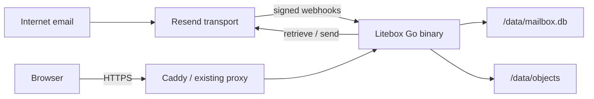

# Litebox

[](https://github.com/Nader-jo/Litebox/actions/workflows/ci.yml)
[](https://github.com/Nader-jo/Litebox/actions/workflows/security.yml)
[](https://github.com/Nader-jo/Litebox/releases/latest)
[](https://github.com/Nader-jo/Litebox/pkgs/container/litebox)
[](https://scorecard.dev/viewer/?uri=github.com/Nader-jo/Litebox)
[](https://goreportcard.com/report/github.com/Nader-jo/Litebox)
[](LICENSE)
[](CONTRIBUTING.md)

**A brutally lightweight, self-hosted human mailbox powered by Resend.**

Litebox gives custom-domain addresses real browser inboxes without asking you to run SMTP, IMAP, Redis, Postgres, Elasticsearch, a queue broker, or a JavaScript production runtime. One installation can host independent mailboxes, aliases, multiple administrators, and multiple browser sessions while retaining the one-container, one-volume default.

> [!IMPORTANT]
> Litebox is pre-1.0 software. Back up `/data`, review the [security model](docs/THREAT_MODEL.md), and test with a non-critical domain before adopting it for important mail.

## Why Litebox?

You own a domain and want `hello@example.com`. Resend already handles the hard internet-facing transport. Litebox owns the part you actually interact with:

- Inbox, unread state, threaded conversations, Sent, Drafts, Archive, Starred, and Trash;
- Compose, Reply, Reply all, CC/BCC, and attachments;
- provider delivery states and retry diagnostics;
- signed, replay-safe webhook ingestion backed by a durable SQLite job queue;
- local raw `.eml` and attachment retention independent of provider retention;
- strict inbound HTML sanitization and remote-image blocking;
- full-text search with useful operators;
- first-run setup, Argon2id passwords, hashed sessions, CSRF protection, and login throttling;
- independent mailboxes, shared aliases, per-mailbox roles, mailbox switching, and revocable device sessions;
- light, configurable alias colors shown consistently in thread rows and conversation messages;
- single-use mailbox invitations and email-based password recovery with session revocation;
- per-user daily or weekly private summaries with counts by mailbox and no message content;
- database-backed installation settings with encrypted Resend credentials and a restart-rotated first-run setup link;
- one provenance-attested, shell-free multi-platform GHCR image that runs on Linux AMD64 and ARM64 VPS hosts;
- built-in `doctor`, `backup`, `restore`, `reindex`, and password-recovery commands;
- responsive server-rendered UI using Go, templ, vendored HTMX, and custom CSS.
- mobile search, keyboard navigation, shortcut help, and clear progress/confirmation feedback.

Litebox is a mailbox, not a mail server and not a Gmail clone.

## Try it now

Start a private local demo with one command. It needs only Docker, binds to
`127.0.0.1`, and does not require a domain or Resend account:

```bash
docker run --rm --name litebox-demo \
  -p 127.0.0.1:8080:8080 \
  -e APP_ENV=development \
  -e APP_BASE_URL=http://localhost:8080 \
  -v litebox-demo-data:/data \
  ghcr.io/nader-jo/litebox:0.4.1
```

Open <http://localhost:8080/setup>. Stop the demo with `Ctrl-C`; Docker creates
the named volume automatically, and demo data remains there until you delete
it. This credential-free example cannot send or receive real email. Development
mode is not a provider safety switch: adding valid Resend credentials enables
provider workflows, so use a dedicated test account and domain.

## Architecture



The required runtime graph is deliberately small:

| Component | Default | Purpose |
| --- | --- | --- |
| Litebox | Required | UI, auth, webhooks, workers, provider adapter |
| SQLite | Embedded | Metadata, sessions, jobs, FTS5, mailbox state |
| Filesystem `BlobStore` | Embedded | Raw email and private attachments |
| Resend | External | Internet email receiving and delivery |
| Reverse proxy | External or optional profile | Public TLS termination |

Read [Architecture](docs/ARCHITECTURE.md) for invariants, module boundaries, data flow, and failure semantics.

## Quick start

### Prerequisites

- Docker Engine with Compose v2;
- a domain you can configure in Resend;
- a Resend API key and webhook signing secret;
- a public HTTPS hostname for webhook delivery.

### 1. Pull the multi-platform image

```bash
git clone --depth 1 https://github.com/Nader-jo/Litebox.git
cd Litebox
cp .env.example .env
# Set LITEBOX_DOMAIN and keep this explicit image pin in .env:
# LITEBOX_IMAGE=ghcr.io/nader-jo/litebox:0.4.1
docker compose --profile proxy pull
docker compose --profile proxy up -d
```

Docker automatically selects the `linux/amd64` or `linux/arm64` image from the
immutable image tag. The repository checkout supplies only the deployment
templates (`compose.yaml`, `Caddyfile`, and `.env.example`); the application
itself always runs from GHCR.

> [!NOTE]
> The immutable `v0.4.1` source tag contains deployment-template defaults that
> can resolve to `latest`. For that release, use the corrected current templates
> above and retain the explicit `0.4.1` image pin. The tag will not be rewritten;
> the next release returns to using its matching source tag and image tag.

The commands above enable the supplied Caddy HTTPS profile. If an existing
reverse proxy already terminates TLS, run `docker compose pull` and
`docker compose up -d` instead, then proxy the public hostname to
`127.0.0.1:8080`.

To build from source for development instead, follow the [Development guide](docs/DEVELOPMENT.md) and use `compose.build.yaml`.

### 2. Complete the first-run wizard

Open the `/setup?token=…` URL printed by the container. The wizard stores the
mailbox identity, public URL, Resend credentials, and first administrator in
SQLite. Each unconfigured production startup rotates and prints a fresh token;
the previous URL stops working, and setup completion invalidates the current
token permanently. Setup commits the token claim, mailbox, first owner, and
encrypted settings atomically, so a failed or concurrent submission cannot
leave a partial installation. Add more people and assign per-mailbox roles from
**Settings → People**.

`create-admin` is an administrator-recovery/bootstrap command, not a complete
headless replacement for the wizard. It creates a login but does not save the
public URL or provider credentials. Use it only after supplying the documented
legacy bootstrap settings or complete **Settings → System** immediately:

```bash
docker compose exec mailbox /app/litebox create-admin \
  --email owner@example.com \
  --name "Mailbox Owner"
```

### 3. Connect Resend

In Resend:

1. add and verify the receiving/sending domain;
2. apply the exact MX, SPF, DKIM, and return-path records shown by Resend;
3. create `https://mail.example.com/webhooks/resend`;
4. subscribe it to `email.received`, `email.sent`, `email.delivered`, `email.delivery_delayed`, `email.bounced`, `email.failed`, `email.suppressed`, and `email.complained`;
5. paste the webhook signing secret into the setup wizard or **Settings → System**. Credentials are encrypted using `/data/.litebox/master.key`.

See [Resend and DNS setup](docs/RESEND_SETUP.md), especially the MX conflict warning.

## Operations

Published images are available at `ghcr.io/nader-jo/litebox`. Production deployments should use a complete version tag such as `0.4.1`, not `latest`. Each release workflow builds, scans, and boots both supported platforms before publishing the GitHub release.

The image uses the same binary for the server and all administrative operations:

```text
litebox help [command]
litebox serve
litebox migrate
litebox healthcheck
litebox doctor [--deep]
litebox backup --output <new-directory>
litebox restore --input <backup-directory>
litebox create-admin --email <email> --name <name>
litebox reset-password --email <email>
litebox reindex
litebox version
```

`help`, `--help`, `version`, and `--version` are handled before configuration or
application initialization, so inspecting the CLI never creates or migrates
data. Unknown commands, invalid flags, missing required options, and unexpected
positional arguments also fail before application startup.
`migrate` opens only the configured SQLite database and applies embedded
migrations; it does not create the master key or mailbox, initialize the
provider or blob store, enqueue jobs, or start the server. Commands that inspect
mailbox data require the matching master key and storage configuration. See
[Configuration](docs/CONFIGURATION.md) for defaults, validation, and setting
lifecycle.

### Health

- `GET /health/live` checks the process only.
- `GET /health/ready` checks SQLite and writable private blob/storage-temp
  directories, caches the deep-probe result for five seconds to bound I/O, and
  deliberately does not depend on Resend availability.
- `/admin/system` shows recent verified webhooks, job state, storage health, and database size without exposing secrets.

### Mailboxes, aliases, and access

- A **mailbox** has independent threads, drafts, folders, unread state, search results, and membership.
- An **alias** receives into one mailbox and can be selected as an outbound `From` identity.
- A user may belong to any number of mailboxes and switch between them without signing in again.
- Roles are `owner`, `admin`, `member`, and `viewer`. Viewers cannot mutate mailbox state or send mail.
- Each browser/device login is a separate session. Users can inspect and revoke sessions under **Settings → Sessions**.
- **Settings → Summary** can send a daily or weekly count-only report to a private address, scoped to all or selected mailboxes.
- Alias colors are assigned automatically and can be changed from **Settings → Mailboxes**; thread rows and messages display the color of the address they matched.
- If one provider message targets addresses in two independent mailboxes, Litebox archives an isolated local copy in each mailbox.

See [Multi-mailbox access](docs/MULTI_MAILBOX.md) for role semantics, routing behavior, and migration details.

Mailbox use, alias colors, and summaries are covered in the [User guide](docs/USER_GUIDE.md). Operators should use [Configuration](docs/CONFIGURATION.md) for runtime settings, encrypted secrets, and setup-token recovery.

### Backups

Litebox intentionally puts SQLite and blobs on one volume. That is simple, not redundant.

The supported MVP backup is quiesced:

```bash
docker compose stop mailbox
docker compose run --rm -v /srv/litebox-backups:/backup mailbox \
  backup --output /backup/backup-$(date +%F)
docker compose start mailbox
```

Every backup contains a consistent SQLite snapshot, the matching instance
master key, and a manifest containing database/key metadata plus every logical
blob key, size, and SHA-256 hash. A missing referenced blob fails the backup.
Restore validates the complete manifest and refuses to overwrite an existing
installation. Manifest hashes detect corruption and mismatch but do not
authenticate an archive; protect backups against replacement and restore only
from a trusted source.

Read [Backup and restore](docs/BACKUP_AND_RESTORE.md) before relying on it.

## Search

Terms search subject, sender, recipients, and plain-text content. Filters can be combined:

```text
invoice
"renewal notice"
from:alice@example.com
to:hello@example.com
subject:invoice
has:attachment
is:unread
is:starred
after:2026-01-01
before:2026-08-01
```

Malformed values for a recognized filter produce a visible error. An
unrecognized colon term such as `label:finance` is searched literally rather
than treated as an undocumented filter; user input is never interpolated into
SQL. Search excludes Trash.

## Security model

Litebox assumes every inbound message is hostile.

- Webhooks are verified against their raw request body before JSON parsing.
- Svix delivery IDs and provider email IDs provide two levels of idempotency.
- HTML is parsed, CID references are rewritten to authenticated routes, remote images are removed, and a strict allow-list sanitizer runs before storage/display.
- Attachments and raw mail are never exposed through the static asset handler.
- SVG and HTML attachments download rather than render in the application origin.
- Session and CSRF secrets are random 256-bit values; only hashes are stored in SQLite.
- The mailbox selector in URL query parameters and the preference cookie is untrusted: every request resolves it through the authenticated user's membership, and content repositories require a mailbox scope.
- Authenticated sends are capped at 30 per user per rolling hour, and each message is capped at 20 recipients.
- Production requires an HTTPS public URL and requires Resend API/webhook credentials when the first-run wizard is completed; an otherwise empty production volume may start only to expose that one-time setup flow.
- The shell-free `scratch` container is non-root, drops Linux capabilities, uses a read-only root filesystem, and writes only to `/data` and a bounded `/tmp` tmpfs.

Review [SECURITY.md](SECURITY.md) for reporting and supported versions, and [Threat model](docs/THREAT_MODEL.md) for trust boundaries and residual risks.

## Development

Requirements: Go 1.26.6+, Docker, and GNU Make (optional). Make targets also use
POSIX shell utilities such as Bash, `test`, and `rm`; on Windows use WSL, MSYS2,
or Git Bash, or run the underlying Go and Docker commands directly. The
patch-level Go floor includes required standard-library security fixes.

```bash
make setup # install pinned tools, generate code, and validate the checkout
make check # generate, format, lint, race-test, audit, build, and validate Compose
```

Run locally with development defaults:

```bash
APP_ENV=development go run ./cmd/mailbox serve
```

Generated `*_templ.go` files are committed so release builds do not need a JavaScript toolchain. CI regenerates them and fails on drift.

See [Development guide](docs/DEVELOPMENT.md) for package boundaries, tests, fake-provider usage, and pull-request expectations.

## Project documentation

| Document | Audience |
| --- | --- |
| [Architecture](docs/ARCHITECTURE.md) | Maintainers and integrators |
| [Historical product requirements](mailbox_prd.md) | Historical product and architecture context |
| [Configuration](docs/CONFIGURATION.md) | Operators and deployers |
| [Multi-mailbox access](docs/MULTI_MAILBOX.md) | Operators and administrators |
| [User guide](docs/USER_GUIDE.md) | Mailbox users |
| [Deployment](docs/DEPLOYMENT.md) | Operators |
| [Safe upgrades](docs/UPGRADING.md) | Operators |
| [Resend setup](docs/RESEND_SETUP.md) | Domain and webhook operators |
| [Backup and restore](docs/BACKUP_AND_RESTORE.md) | Operators |
| [Threat model](docs/THREAT_MODEL.md) | Security reviewers |
| [Development](docs/DEVELOPMENT.md) | Contributors |
| [Release process](docs/RELEASES.md) | Maintainers |
| [Repository settings](docs/REPOSITORY_SETTINGS.md) | Repository administrators |
| [Roadmap](ROADMAP.md) | Community |
| [Vision](VISION.md) | Users and contributors |
| [Contributing](CONTRIBUTING.md) | Contributors |
| [Contributors](CONTRIBUTORS.md) | Community |
| [Governance](GOVERNANCE.md) | Maintainers and contributors |
| [Support](SUPPORT.md) | Users and operators |

## Deliberate non-goals

Litebox does not implement SMTP, IMAP, POP3, JMAP, multi-tenant SaaS isolation, shared-inbox assignment/notes, contacts, calendars, rich-text composition, rules, scheduled sending, or a spam classifier. Optional S3-compatible storage is a future adapter; it is not a dependency of the default system.

## Community

Bug reports, focused feature proposals, documentation improvements, tests, and careful security reviews are welcome. Start with the streamlined [contribution guide](CONTRIBUTING.md), read the project [vision](VISION.md), and meet the people in [CONTRIBUTORS.md](CONTRIBUTORS.md). Participation follows [GOVERNANCE.md](GOVERNANCE.md) and the [Code of Conduct](CODE_OF_CONDUCT.md).

## License

Litebox is licensed under the [Apache License 2.0](LICENSE). Vendored HTMX remains under its BSD 2-Clause license, and selected Tabler Icons v3.46.0 paths remain under MIT; see [NOTICE](NOTICE).
