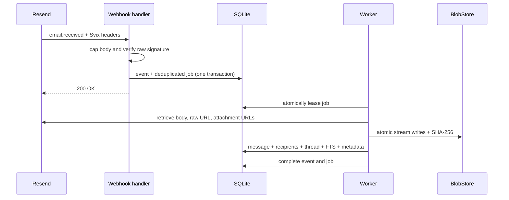

# Architecture

Litebox is a modular monolith optimized for one user, one primary mailbox, and one durable volume. This document describes the constraints contributors must preserve.

## Architectural invariants

1. `docker compose up -d` starts one required application service.
2. Normal mailbox reads never depend on old provider content still existing.
3. Domain and HTTP code use `blobstore.Store`; they never construct filesystem paths directly.
4. Webhook receipt and background work are durable before HTTP acknowledgement.
5. A logical outbound message has one stable provider idempotency key.
6. Inbound HTML is hostile until it passes the local sanitization pipeline.
7. `/data` is private application state, never a static HTTP root.
8. Infrastructure is added only for a measured requirement.

## Runtime topology

```text
HTTPS ingress
    |
    v
Litebox Go process
    |-- net/http routes and middleware
    |-- templ + vendored HTMX UI
    |-- Resend provider adapter
    |-- SQLite repositories and durable workers
    |-- filesystem BlobStore
    |
    +-- /data/mailbox.db
    +-- /data/objects/raw/YYYY/MM/<id>.eml
    +-- /data/objects/attachments/YYYY/MM/<id>
    +-- /data/objects/drafts/<draft-id>/<attachment-id>
```

SQLite runs in WAL mode with foreign keys, a five-second busy timeout, `synchronous=NORMAL`, bounded connections, and FTS5. Blob bytes do not live in SQLite.

## Package boundaries

| Package | Responsibility |
| --- | --- |
| `cmd/mailbox` | CLI dispatch, signals, build metadata |
| `internal/app` | Dependency graph and lifecycle |
| `internal/config` | Typed environment loading and fail-fast validation |
| `internal/db` | SQLite connection policy and embedded migrations |
| `internal/repository` | All SQL and transactional state transitions |
| `internal/blobstore` | Private immutable byte storage contract and `FileStore` |
| `internal/provider` | Resend SDK boundary and provider-neutral models |
| `internal/service` | Inbound, outbound, deletion, and event workflows |
| `internal/jobs` | Durable leases, retries, dead-letter behavior |
| `internal/mail` | Addressing, subject rules, HTML safety, delivery reducer |
| `internal/search` | Validated search language |
| `internal/httpserver` | Routes, auth boundary, limits, response security |
| `internal/ui` | templ components and view models |
| `internal/ops` | Backup, restore, and integrity operations |
| `web` | Embedded browser assets |

HTTP handlers contain no SQL. Application services contain no Resend SDK types. Mailbox services contain no direct filesystem calls.

## Inbound state transition



Two keys prevent duplicate mail:

- `webhook_events.svix_id` deduplicates one webhook delivery;
- `messages.resend_email_id` and `jobs.dedupe_key=ingest:<email-id>` deduplicate provider-level replay under a different delivery ID.

Blob keys derived from provider resources are deterministic. `FileStore.Put` treats an existing byte-identical object as success and a content mismatch as a collision. A crash after a blob commit but before a database commit therefore remains retry-safe.

## Outbound state transition

Sending a draft is a local transaction:

1. validate recipients and attachment budget;
2. create an outbound message and normalized recipients;
3. move attachment ownership to the message;
4. update the thread and FTS row;
5. enqueue `send_outbound` with `send:<message-id>`;
6. delete the draft;
7. commit and immediately show `Queued`.

The worker uses `litebox-send/<message-id>` for every provider retry. Local `resend_email_id` is the long-lived duplicate-send guard because provider idempotency windows are finite.

Provider lifecycle events are immutable rows. The aggregate message state uses explicit terminal precedence rather than arrival order.

## Threading

Inbound selection uses, in order:

1. `In-Reply-To`;
2. identifiers in `References`;
3. a conservative 30-day normalized-subject and participant-overlap fallback.

If the evidence is uncertain, Litebox creates a new thread. Outbound replies preserve `In-Reply-To` and append a deduplicated `References` chain.

## HTML and attachment boundary

The raw message is archived before normalized content becomes the long-term source of truth. The display path:

1. parses HTML;
2. rewrites known `cid:` images to authenticated inline routes;
3. removes remote image URLs;
4. applies a strict element and attribute allow-list;
5. stores only sanitized HTML for normal rendering;
6. enforces a CSP that forbids external image, script, frame, and object sources.

Attachment routes authenticate before looking up a logical object. SVG and HTML never render inline. Storage keys and absolute paths never appear in the browser.

## Jobs and recovery

Workers atomically change one runnable job to `running`, increment the attempt counter, and set `lease_owner`/`leased_until`. Expired leases return to the queue. Failures use bounded exponential backoff with jitter. A permanent error or exhausted attempt budget enters `dead` and is visible/retryable in the system page.

Inbound jobs use a final best-effort attempt: readable mail can become `ready_without_raw`, and an unavailable attachment becomes visible with storage-error metadata instead of hiding the whole email forever.

## Future S3 adapter

The `blobstore.Store` interface deliberately supports a later S3-compatible implementation. Shipping it must not make S3, RustFS, R2, AWS, or any SDK a default dependency. Backend migration requires an explicit checksum-verifying operational command; changing `STORAGE_BACKEND` alone must never imply that historical bytes moved.

## Decisions

Architecture decisions are recorded under [`docs/decisions`](decisions/). New required services, changes to security boundaries, or incompatible data-format decisions require an ADR.
