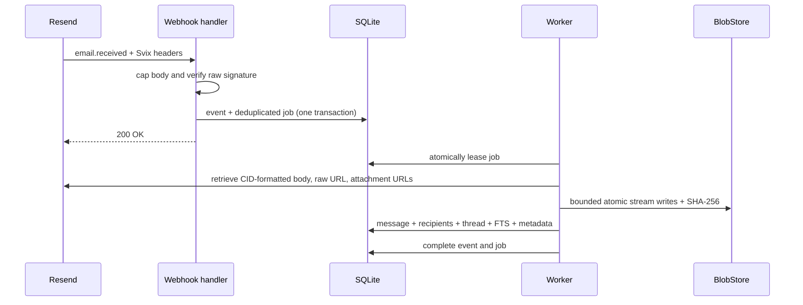

# Architecture

Litebox is a modular monolith optimized for one self-hosted installation, multiple mailbox identities, and one durable volume. This document describes the constraints contributors must preserve.

## Architectural invariants

1. `docker compose up -d` starts one required application service.
2. Normal mailbox reads never depend on old provider content still existing.
3. Domain and HTTP code use `blobstore.Store`; they never construct filesystem paths directly.
4. Webhook receipt and background work are durable before HTTP acknowledgement.
5. A logical outbound message has one stable provider idempotency key.
6. Inbound HTML is hostile until it passes the local sanitization pipeline.
7. `/data` is private application state, never a static HTTP root.
8. Infrastructure is added only for a measured requirement.
9. Sessions authenticate users; mailbox memberships authorize content. A session never stores an authority-bearing mailbox list.
10. Every interactive content query is scoped by an authorized `mailbox_id`; object identifiers alone never grant access.

## Runtime topology

```text
HTTPS ingress
    |
    v
Litebox Go process
    |-- net/http routes and middleware
    |-- templ + vendored HTMX UI
    |-- Resend provider adapter
    |-- SQLite repositories and durable workers
    |-- filesystem BlobStore
    |
    +-- /data/mailbox.db
    +-- /data/objects/raw/YYYY/MM/<id>.eml
    +-- /data/objects/attachments/YYYY/MM/<id>
    +-- /data/objects/drafts/<draft-id>/<attachment-id>
```

SQLite runs in WAL mode with foreign keys, a five-second busy timeout,
`synchronous=NORMAL`, bounded connections, and FTS5. Filesystem paths become
escaped absolute `file:` URIs before SQLite sees them, including the read-only
backup preflight, so `?` or `#` in a directory name cannot alter URI options.
Blob bytes do not live in SQLite.

## Package boundaries

| Package | Responsibility |
| --- | --- |
| `cmd/mailbox` | CLI dispatch, signals, build metadata |
| `internal/app` | Dependency graph and lifecycle |
| `internal/config` | Typed environment loading and fail-fast validation |
| `internal/db` | SQLite connection policy and embedded migrations |
| `internal/repository` | All SQL and transactional state transitions |
| `internal/blobstore` | Private immutable byte storage contract and `FileStore` |
| `internal/provider` | Resend SDK boundary and provider-neutral models |
| `internal/service` | Inbound, outbound, deletion, and event workflows |
| `internal/jobs` | Durable leases, retries, dead-letter behavior |
| `internal/mail` | Addressing, subject rules, HTML safety, delivery reducer |
| `internal/search` | Validated search language |
| `internal/httpserver` | Routes, auth boundary, limits, response security |
| `internal/ui` | templ components and view models |
| `internal/ops` | Backup, restore, and integrity operations |
| `web` | Embedded browser assets |

HTTP handlers contain no SQL. Application services contain no Resend SDK types. Mailbox services contain no direct filesystem calls.

## Identity and mailbox authorization

The durable relationship is `users -> mailbox_memberships -> mailboxes -> mailbox_addresses`. Users may hold different roles in different mailboxes, and each user may have multiple independent session rows. Navigable links carry the active mailbox as a `mailbox` query parameter so separate tabs can remain independent; an HttpOnly mailbox cookie is retained as a fallback preference. Both are untrusted: authentication resolves the selected mailbox against current memberships on every request and falls back to the user's first authorized mailbox.

`owner` and `admin` may manage mailbox configuration and people, `member` may read and write mail, and `viewer` is read-only. Repository methods serving HTTP content require a mailbox ID and include it in reads and mutations. Attachment authorization joins through the owning message or draft. This prevents a valid identifier copied from one mailbox from crossing into another.

Installation settings are persisted in SQLite after first-run setup. The public
URL, session lifetime, log level, request/attachment limits, and encrypted
Resend credentials come from that snapshot instead of being overwritten by
later environment changes. Fields exposed under **Settings → System** update
the running application; a log-level change also updates the active logger
immediately. Setup claims the unconfigured installation/token, updates the
primary mailbox, creates the first owner, and saves encrypted settings in one
SQLite transaction, so concurrent submissions cannot leave partial state. The
instance master key remains deployment state under
`/data/.litebox/master.key`; a new installation publishes it before creating
SQLite, while an existing database uses load-only key semantics. Invitation and
password-reset tokens are single-use, expiring hashes. Password-reset delivery
uses a bounded process-local email queue so the public request does not wait for
the provider; it is intentionally not a durable job. Each user can also
configure one metadata-only daily or weekly summary scoped to accessible
mailboxes.

## Inbound state transition



Two keys prevent duplicate mail:

- `webhook_events.svix_id` deduplicates one webhook delivery;
- `messages(mailbox_id, resend_email_id)` and `jobs.dedupe_key=ingest:<email-id>` deduplicate provider-level replay under a different delivery ID while allowing one provider message to be archived independently in multiple destination mailboxes.

If Resend redelivers the same received email under a different Svix ID, Litebox
retains the second verified webhook as terminal `duplicate` rather than leaving
a queued event without a job.

Blob keys derived from provider resources are deterministic. `FileStore.Put`
publishes a fully synced temporary inode with a no-replace commit, treats an
existing byte-identical object as success, and treats a content mismatch as a
collision. Concurrent writers cannot replace an immutable winner. A crash after
a blob commit but before a database commit therefore remains retry-safe. The
filesystem implementation first attempts a hard-link publication. Where hard
links are unavailable, an adjacent `.litebox-lock` serializes an atomic rename;
blob waits honor context cancellation and all waits fail with the exact lock
path after a bounded timeout rather than guessing that a lock is stale.

## Outbound state transition

Sending a draft is a local transaction:

1. validate recipients and attachment budget;
2. create an outbound message and normalized recipients;
3. move attachment ownership to the message;
4. update the thread and FTS row;
5. enqueue `send_outbound` with `send:<message-id>`;
6. delete the draft;
7. commit and immediately show `Queued`.

The worker uses `litebox-send/<message-id>` for every provider retry. Before any
provider call, it recomputes each stored attachment's size and SHA-256 digest;
a mismatch becomes a permanent local integrity error. Local `resend_email_id`
is the long-lived duplicate-send guard because provider idempotency windows are
finite.

Provider lifecycle events are immutable rows. The aggregate message state uses explicit terminal precedence rather than arrival order.

## Threading

Inbound selection uses, in order:

1. `In-Reply-To`;
2. identifiers in `References`;
3. a conservative 30-day normalized-subject and participant-overlap fallback.

If the evidence is uncertain, Litebox creates a new thread. Outbound replies preserve `In-Reply-To` and append a deduplicated `References` chain.

## HTML and attachment boundary

Litebox attempts to archive the raw message before normalized content becomes
the long-term source of truth. A raw archive over the configured upload cap is
omitted and the readable message is committed as `ready_without_raw`. Litebox
explicitly requests `html_format=cid` from Resend so inline references remain
identifiable instead of arriving as `data:` URLs. The display path:

1. parses HTML;
2. rewrites known `cid:` images to authenticated inline routes;
3. removes remote image URLs;
4. applies a strict element and attribute allow-list;
5. stores only sanitized HTML for normal rendering;
6. enforces a CSP that forbids external image, script, frame, and object sources.

Attachment routes authenticate before looking up a logical object. SVG and HTML
never render inline. Dynamic HTML and authenticated attachment responses use
`Cache-Control: no-store`; storage keys and absolute paths never appear in the
browser. Multipart forms keep at most 4 MiB of file parts in memory, spill the
remainder to the process temporary directory, and remove those temporary files
after handling the request.

## Jobs and recovery

Workers atomically change one runnable job to `running`, increment the attempt
counter, and set `lease_owner`/`leased_until`. A worker renews the lease while a
handler is active. Completion, retry, and dead-letter transitions are accepted
only from the current lease owner, so a stalled worker cannot overwrite a job
reclaimed by another worker. Expired, unrenewed leases return to the queue.
Failures use bounded exponential backoff with jitter. A permanent error or
exhausted attempt budget enters `dead` and is visible/retryable in the system
page.

The process scheduler runs maintenance every minute. A UTC-date dedupe key
enqueues one expired-session cleanup per day even when a long-lived process
crosses midnight; the same pass also schedules due summaries.

Inbound jobs use bounded, best-effort archival. The raw `.eml` uses the upload
cap; attachments share one aggregate per-message byte budget and only the first
configured count are processed. A deterministic raw-size violation immediately
produces `ready_without_raw`, and an over-budget attachment remains visible with
storage-error metadata. Transient provider/storage failures retry until the
final best-effort attempt, when the same degraded states keep readable mail from
being hidden forever.

## Future S3 adapter

The `blobstore.Store` interface deliberately supports a later S3-compatible implementation. Shipping it must not make S3, RustFS, R2, AWS, or any SDK a default dependency. Backend migration requires an explicit checksum-verifying operational command; changing `STORAGE_BACKEND` alone must never imply that historical bytes moved.

## Decisions

Architecture decisions are recorded under [`docs/decisions`](decisions/). New required services, changes to security boundaries, or incompatible data-format decisions require an ADR.
