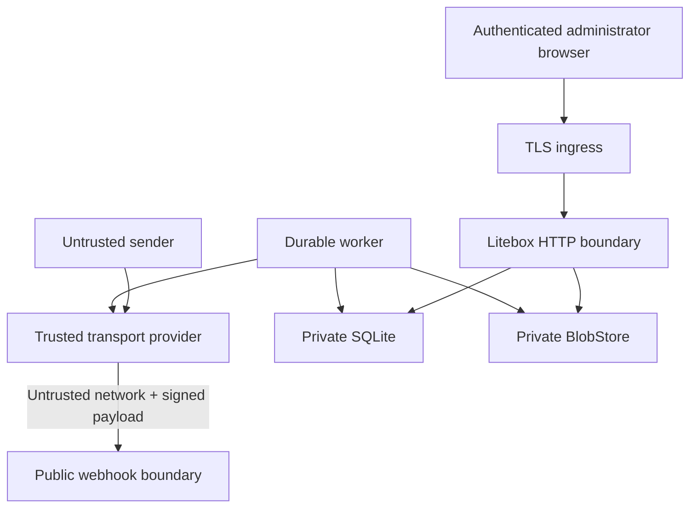

# Threat model

This document records Litebox's security assumptions, controls, and residual risk. It is not a claim of formal verification.

## Assets

- administrator credentials and active sessions;
- Resend API and webhook secrets;
- message metadata and searchable text in SQLite;
- raw `.eml` archives and attachment bytes;
- outbound authority for the configured mailbox;
- backup datasets and manifests.

## Trust boundaries

The content of a correctly signed inbound event is still untrusted email content. Authentication proves provider origin, not sender safety.

## Threats and controls

### Forged or replayed webhook

Controls: one-megabyte default body cap; raw-body Resend/Svix signature verification; timestamp tolerance in the official SDK; unique `svix_id`; provider-email job dedupe; fast acknowledgement only after transaction commit.

Residual risk: a compromised provider account or webhook secret can submit valid events. Rotate credentials and investigate unexplained verified traffic.

### Active inbound HTML and tracking

Controls: raw bytes remain private; DOM parsing; CID rewrite to authenticated routes; remote image removal; strict Bluemonday allow-list; no script/form/frame/object/SVG/MathML; no inline script; restrictive CSP; `nosniff`; no-referrer links.

Residual risk: sanitized content can contain persuasive phishing text and links. Litebox does not claim mail or attachments are safe.

### Malicious attachment

Controls: object keys never use filenames; temp write, fsync, checksum, atomic rename; private authenticated download; attachment disposition by default; inline allow-list limited to common raster images; HTML and SVG are never inline; request and count limits.

Residual risk: downloaded files can exploit local applications. Antivirus scanning is not included in the MVP.

### Session theft and CSRF

Controls: Argon2id passwords; generic login errors; per-IP/account throttling; 256-bit session token; only SHA-256 token hashes in SQLite; HttpOnly/Secure/SameSite cookie; separate session-bound CSRF secret; constant-time validation on every authenticated unsafe request; session revocation on password reset.

Controls also include a user-visible active-session list, per-session revocation, and revocation of all sessions when a password is reset.

Residual risk: host/browser compromise defeats web-session controls. Litebox does not currently provide a second factor.

### Invitation and password-recovery tokens

Controls: raw invitation and password-reset tokens are delivered only in the
account email; SQLite stores only SHA-256 token hashes; tokens are single-use
and expire after 72 hours for invitations or 30 minutes for password resets;
consumption is atomic; and a successful password reset revokes every existing
session for that user.

Residual risk: compromise of the recipient's email account or access to an
unexpired token URL grants the same account action as the legitimate recipient.
Operators should protect the public URL, provider credentials, and mailbox data
as one installation-wide trust boundary.

### Cross-mailbox access

Controls: sessions authenticate a user rather than a mailbox; the active-mailbox query parameter and preference cookie are treated as untrusted input; every request resolves current membership; mailbox content reads and mutations include `mailbox_id`; draft reply targets and attachment ownership are checked against the active mailbox; roles separate owner/admin configuration, member write access, and viewer read-only access; the last mailbox owner cannot be removed or demoted.

Residual risk: Litebox is a single trusted installation, not a hostile multi-tenant service. Host, database, backup, or installation-wide operator compromise exposes all local mailboxes.

### Header injection and bulk abuse

Controls: standard-library RFC address parser; CR/LF removal from user headers; outbound `From` must be an enabled database address belonging to the active mailbox; 20-recipient cap; 25 MiB raw attachment cap; authenticated and CSRF-protected send routes; provider quotas remain authoritative.

Residual risk: a compromised administrator can abuse the configured provider account. Litebox is not a bulk-sending platform.

### Path traversal and public blob exposure

Controls: generated relative keys; absolute/traversal/NUL rejection; root-relative resolution check; `/data` absent from static FS; authenticated lookup by attachment ID; browser never receives storage keys or server paths.

### Crash between provider send and local update

Controls: stable `litebox-send/<message-id>` key for all provider retries; one durable logical message; provider events retained for reconciliation; existing `resend_email_id` prevents later submission.

Residual risk: Resend's idempotency window is finite. A very long unresolved outage in the dangerous post-accept/pre-commit window can require operator reconciliation.

### Disk exhaustion or local I/O failure

Controls: webhook is durable before blob work; retries use bounded backoff; temp files never appear as complete blobs; best-effort final ingest makes readable mail visible with storage diagnostics; readiness checks storage writes; doctor finds missing references.

Residual risk: one full/lost volume affects both SQLite and blobs. Monitor it and maintain independent backups.

### Proxy header spoofing

Controls: forwarded client IP is honored only when the direct peer matches `TRUSTED_PROXY_CIDRS`; otherwise `RemoteAddr` is used.

## Secrets

Provider secrets enter through the first-run/settings forms or the legacy runtime
environment bootstrap and are stored encrypted in SQLite with the instance
master key. Logs intentionally omit passwords, cookies, message bodies,
attachments, API keys, webhook secrets, and recipient addresses by default. Admin
pages show safe summaries, never raw job payloads or absolute paths.

## Out of scope

- compromise of Resend, the host kernel, Docker daemon, reverse proxy, administrator browser, DNS registrar, or backup credentials;
- malware detection in message attachments;
- spam/phishing classification;
- hostile multi-tenant SaaS isolation;
- end-to-end encryption, PGP, or S/MIME;
- deletion guarantees for provider-side temporary copies.

## Security review checklist

Changes affecting authentication, webhooks, HTML, downloads, blob keys, SQL construction, outbound headers, proxy trust, backups, or release permissions require focused tests and an update to this document or an ADR.
