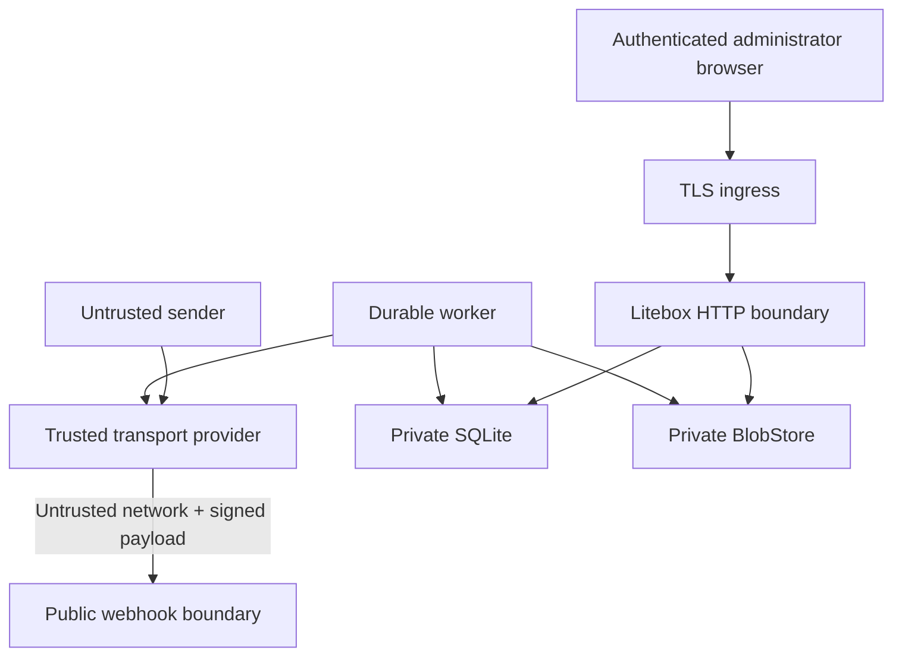

# Threat model

This document records Litebox's security assumptions, controls, and residual risk. It is not a claim of formal verification.

## Assets

- administrator credentials and active sessions;
- Resend API and webhook secrets;
- message metadata and searchable text in SQLite;
- raw `.eml` archives and attachment bytes;
- outbound authority for the configured mailbox;
- backup datasets and manifests.

## Trust boundaries

The content of a correctly signed inbound event is still untrusted email content. Authentication proves provider origin, not sender safety.

## Threats and controls

### Forged or replayed webhook

Controls: one-megabyte default body cap; raw-body Resend/Svix signature
verification; timestamp tolerance in the official SDK; unique `svix_id`;
provider-email job dedupe; and fast acknowledgement only after transaction
commit. A second verified delivery for the same received email under a different
Svix ID is retained as terminal `duplicate`, not left queued without a job.

Residual risk: a compromised provider account or webhook secret can submit valid events. Rotate credentials and investigate unexplained verified traffic.

### Active inbound HTML and tracking

Controls: the provider body is requested with `html_format=cid`; raw bytes remain
private; DOM parsing; known CID rewrite to authenticated routes; `data:` and
remote image removal; strict Bluemonday allow-list; no
script/form/frame/object/SVG/MathML; no inline script; restrictive CSP;
`nosniff`; no-referrer links; and `Cache-Control: no-store` on dynamic HTML.

Residual risk: sanitized content can contain persuasive phishing text and links. Litebox does not claim mail or attachments are safe.

### Malicious attachment

Controls: object keys never use filenames; temp write, fsync, checksum, atomic
no-replace commit; private authenticated download; attachment disposition by
default; inline allow-list limited to common raster images; HTML and SVG are
never inline; bounded browser requests; and per-message inbound/outbound byte
and count limits. An oversized inbound raw archive becomes
`ready_without_raw`; excess attachment metadata is skipped at the count limit,
and over-budget attachment entries remain visible but unavailable. These
deterministic outcomes do not create an unbounded retry loop. Multipart parsing
uses a fixed 4 MiB file-part memory threshold, spills larger parts to bounded
temporary storage, and removes spill files after the request. Before an
outbound provider call, Litebox recomputes every attachment's stored size and
SHA-256 digest; authenticated attachment responses are private and `no-store`.

Residual risk: downloaded files can exploit local applications. Antivirus scanning is not included in the MVP.

### Provider-controlled download URL

Controls: production raw-message and attachment downloads require HTTPS;
redirect targets pass the same policy; environment proxies are not used; and
every dial resolves the hostname inside the guarded transport, rejects
loopback, private, link-local, carrier-grade NAT, documentation, benchmark,
unspecified, and reserved destinations, then dials a vetted address directly.
This closes the gap between URL validation and DNS resolution. Response bodies
are streamed through size limits into private storage. Plain HTTP localhost is
available only through the injectable provider test client.

Residual risk: Resend is a trusted transport boundary. A compromised provider
or service on an allowed public address can still return malicious content or
consume bounded network resources; egress filtering remains a useful
host-level defense.

### Session theft and CSRF

Controls: Argon2id passwords; generic login errors; dummy Argon2 verification
for unknown accounts; bounded concurrent password work; separate per-IP and
per-account throttles; 256-bit session token; only SHA-256 token hashes in
SQLite; HttpOnly/Secure/SameSite cookie; separate session-bound CSRF secret;
constant-time validation on every authenticated unsafe request; and session
revocation on password reset. Unauthenticated setup, login, invitation, and
password-reset POSTs reject cross-site fetch metadata or an `Origin`/`Referer`
that does not match the configured public origin, preventing login CSRF and
cross-site account-form submission.

Controls also include a user-visible active-session list, per-session revocation, and revocation of all sessions when a password is reset.

Residual risk: headerless non-browser clients are intentionally accepted, so
the unauthenticated same-origin check is browser defense-in-depth rather than
client authentication. Host/browser compromise defeats web-session controls.
Litebox does not currently provide a second factor.

### Invitation and password-recovery tokens

Controls: raw invitation and password-reset tokens are delivered only in the
account email; SQLite stores only SHA-256 token hashes; tokens are single-use
and expire after 72 hours for invitations or 30 minutes for password resets;
consumption is atomic; password hashing shares the bounded Argon2 work pool;
and a successful password reset revokes every existing session for that user.
Reset requests have separate per-account and per-client-IP limits and a generic,
minimum-duration response. Token persistence and email delivery for a known
account are queued together, so provider and token-write latency do not disclose
whether an account exists.

Residual risk: compromise of the recipient's email account or access to an
unexpired token URL grants the same account action as the legitimate recipient.
Password-reset delivery uses a bounded process-local queue rather than the
durable job queue; a full queue, provider failure, or shutdown can lose that
notification, and the user must request another link. Operators should protect
the public URL, provider credentials, and mailbox data as one
installation-wide trust boundary.

### First-run setup race or token reuse

Controls: production setup requires the current restart-rotated token. One
SQLite transaction claims the still-unconfigured installation, consumes that
token, updates the primary mailbox, creates the first owner, and persists the
encrypted settings. Concurrent or repeated submissions cannot create partial
setup state, and a failure rolls the entire transition back.

### Cross-mailbox access

Controls: sessions authenticate a user rather than a mailbox; the active-mailbox query parameter and preference cookie are treated as untrusted input; every request resolves current membership; mailbox content reads and mutations include `mailbox_id`; draft reply targets and attachment ownership are checked against the active mailbox; roles separate owner/admin configuration, member write access, and viewer read-only access; the last mailbox owner cannot be removed or demoted.

Residual risk: Litebox is a single trusted installation, not a hostile multi-tenant service. Host, database, backup, or installation-wide operator compromise exposes all local mailboxes.

### Header injection and bulk abuse

Controls: standard-library RFC address parser; CR/LF removal from user headers;
outbound `From` must be an enabled database address belonging to the active
mailbox; 20-recipient cap; 25 MiB default raw attachment cap; stored size/digest
verification immediately before send; authenticated and CSRF-protected send
routes; provider quotas remain authoritative.

Residual risk: a compromised administrator can abuse the configured provider account. Litebox is not a bulk-sending platform.

### Path traversal and public blob exposure

Controls: generated relative keys; absolute/traversal/NUL rejection; root-relative resolution check; `/data` absent from static FS; authenticated lookup by attachment ID; browser never receives storage keys or server paths.

### Crash between provider send and local update

Controls: stable `litebox-send/<message-id>` key for all provider retries; one durable logical message; provider events retained for reconciliation; existing `resend_email_id` prevents later submission.

Residual risk: Resend's idempotency window is finite. A very long unresolved outage in the dangerous post-accept/pre-commit window can require operator reconciliation.

### Disk exhaustion or local I/O failure

Controls: webhook is durable before blob work; retries use bounded backoff; temp
files never appear as complete blobs; best-effort final ingest makes readable
mail visible with storage diagnostics; multipart spill files are removed;
readiness probes SQLite plus writes in both configured storage directories; and
doctor finds missing references. Readiness results are cached for five seconds
to prevent health polling from creating continuous disk I/O.

Residual risk: readiness can lag a storage-state change by up to five seconds.
One full/lost volume affects both SQLite and blobs. Monitor it and maintain
independent backups.

### Proxy header spoofing

Controls: forwarded client IP is honored only when the direct peer matches
`TRUSTED_PROXY_CIDRS`; otherwise `RemoteAddr` is used. Litebox walks
`X-Forwarded-For` right-to-left across trusted proxy hops and selects the first
untrusted address. A malformed chain falls back to the direct peer instead of
accepting a client-controlled prefix.

### Malicious or mismatched backup

Controls: restore accepts only the supported manifest version, exact
`mailbox.db`/`master.key` object names, a 32-byte key, a 16 MiB manifest, and at
most 100,000 blob entries. It preflights canonical, contained regular-file paths
and unique blob keys; rejects absolute, drive-prefixed, backslash, traversal,
and symlink-escape paths; validates size and SHA-256 metadata; decrypts persisted
settings with the proposed key; refuses a different existing master key;
verifies all content before destination writes; requires the manifest and
restored database to reference exactly the same blobs; restores only into an
absent database and empty object root; and rolls back partial output on failure.

Residual risk: SHA-256 metadata checks integrity and consistency, not
authenticity. An attacker who can replace the database, key, blobs, and manifest
can produce a different self-consistent archive; restore only backups obtained
through a trusted, authenticated channel. A valid backup contains all mailbox
content and the key that decrypts provider credentials, so anyone who obtains
it has installation-wide access. Encrypt backup storage, restrict access, and
destroy restore-drill copies securely.

## Secrets

Provider secrets enter through the first-run/settings forms or the legacy runtime
environment bootstrap and are stored encrypted in SQLite with the instance
master key. A new installation publishes its key before creating the database;
an existing database must load an existing regular 32-byte key and fails before
migration if it is absent or invalid. It never silently generates a replacement
for established encrypted state. Logs intentionally omit passwords, cookies,
message bodies, attachments, API keys, webhook secrets, and recipient addresses
by default. Admin pages show safe summaries, never raw job payloads or absolute
paths.

## Out of scope

- compromise of Resend, the host kernel, Docker daemon, reverse proxy, administrator browser, DNS registrar, or backup credentials;
- malware detection in message attachments;
- spam/phishing classification;
- hostile multi-tenant SaaS isolation;
- end-to-end encryption, PGP, or S/MIME;
- deletion guarantees for provider-side temporary copies.

## Security review checklist

Changes affecting authentication, webhooks, HTML, downloads, blob keys, SQL construction, outbound headers, proxy trust, backups, or release permissions require focused tests and an update to this document or an ADR.
